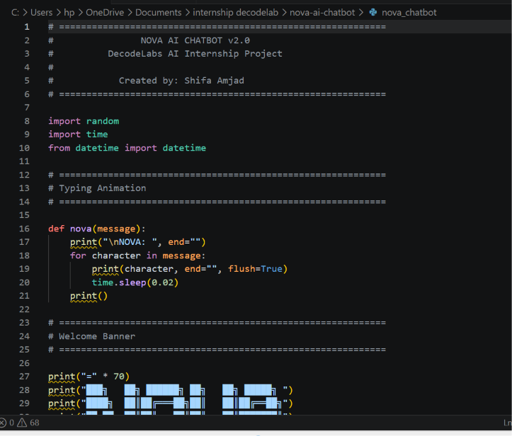
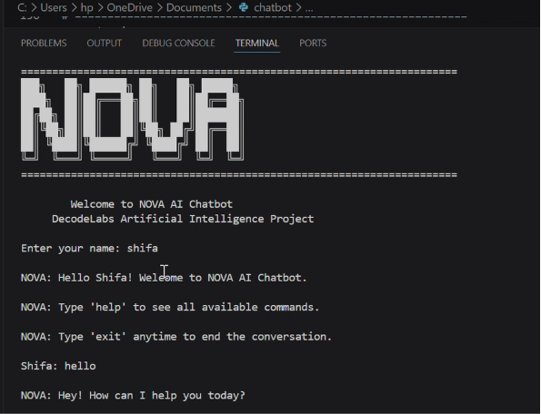

<div align="center">

# 🤖 NOVA AI Chatbot

### A Premium Rule-Based AI Chatbot Built with Python

Developed as **Project 1** for the **DecodeLabs Artificial Intelligence Internship**


</div>

---

# 📖 Overview

NOVA is a **Rule-Based AI Chatbot** developed in **Python** using **if-elif-else decision-making logic**. The chatbot is designed to simulate human conversation by responding to predefined commands and providing an interactive command-line experience.

This project was created as part of the **DecodeLabs Artificial Intelligence Internship** to strengthen programming fundamentals, logical thinking, and rule-based AI concepts.

---

# ✨ Features

- 👋 Interactive Welcome Screen
- 🤖 Rule-Based Conversation
- 💬 60+ Predefined Commands
- 🧠 AI & Python Knowledge
- 📅 Current Date & Time
- 🧮 Built-in Calculator
- 😂 Random Jokes
- 💡 Motivational Quotes
- 📚 Study Tips
- 💻 Coding Tips
- ❤️ Mood Detection
- 📊 Conversation Statistics
- 💾 Save Chat History
- 📝 Session Summary
- ⚡ Typing Animation

---

# 🛠️ Technologies Used

| Technology | Purpose |
|------------|----------|
| Python | Programming Language |
| Random Module | Random Responses |
| Datetime Module | Date & Time |
| Time Module | Typing Animation |
| File Handling | Save Chat History |

---

# 📂 Project Structure

```text
nova-ai-chatbot/
│
├── nova_chatbot.py
├── README.md
├── LICENSE
├── .gitignore
└── screenshots/
```

---

# 🚀 How to Run

### Clone the Repository

```bash
git clone https://github.com/Shifa-Amjad/nova-ai-chatbot.git
```

### Move into the Project Folder

```bash
cd nova-ai-chatbot
```

### Run the Project

```bash
python nova_chatbot.py
```

---

# 💬 Sample Commands

```text
hello
help
what is ai
tell me a joke
calculator
date
time
motivate me
coding tip
study tip
save history
statistics
exit
```

---
# 📸 Project Screenshots

## 💻 Source Code



---

## 🤖 Chatbot Running




---

# 🎯 Learning Outcomes

Through this project, I improved my understanding of:

- Python Programming
- Rule-Based Artificial Intelligence
- Control Flow
- Problem Solving
- File Handling
- Software Development
- User Interaction
- Logical Decision Making

---

# 🌟 Future Improvements

- GUI Version using Tkinter
- Voice Recognition
- Speech Output
- Database Integration
- Natural Language Processing (NLP)
- Machine Learning Integration

---

# 👩‍💻 Author

## Shifa Amjad

**BS Artificial Intelligence Student**

Artificial Intelligence Intern at **DecodeLabs**

GitHub: https://github.com/Shifa-Amjad

---

# ⭐ Support

If you found this project useful, consider giving it a ⭐ on GitHub.

It motivates me to continue building more AI projects.

---

<div align="center">

## Thank You ❤️

**Built with Python • Artificial Intelligence • DecodeLabs Internship**

</div>
